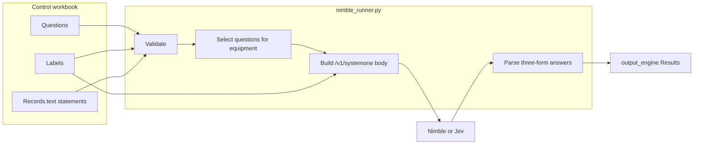
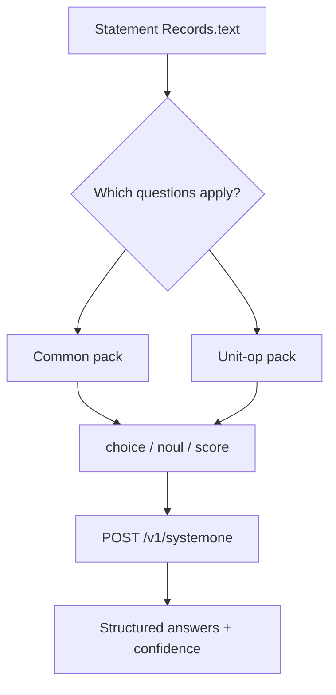
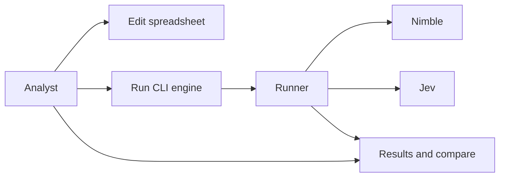

# Functional Specification — nimble_plant (v1.0-dev)

| | |
|---|---|
| Product | Batch classifier for plant-operations **statements** |
| Engines | **Nimble** (local Ollama) and **Jev** (TypeSafe cloud) — same `/v1/systemone` contract |
| Control file | [`nimble_classifier_workbook.xlsx`](../nimble_classifier_workbook.xlsx) |
| Program | [`nimble_runner.py`](../nimble_runner.py) |
| Operator guide | [`../README.md`](../README.md) |

This document explains **what we classify**, **how the spreadsheet defines the work**, **how the program turns sheets into API calls**, and **how Nimble/Jev return three kinds of answers**. It is the as-built industry view, not a dump of CLI flags.

---

## 1. Industry problem

Plant staff write short free-text **statements** about equipment (pumps, heat exchangers, columns, later compressors, …): leaks, fouling, trips, off-spec product, urgency of follow-up.

Reliability and operations need those statements turned into **structured fields** that can be reviewed, compared, and trended — not another paragraph of AI prose.

**Our approach**

1. Treat each spreadsheet row’s `text` as one **statement** about one asset (`equipment_type` + tag).
2. Ask a fixed set of **questions** — some **common to all equipment** (failure mode, containment, load, urgency, impact, potential impact), some **unit-operation specific** (e.g. shell/tube cross-contamination on exchangers; off-spec / stability on columns).
3. Force every answer into **exactly one of three forms** that decision models understand: **choice**, **noul** (yes/no), or **score**.
4. Run the same question pack through **Nimble** and/or **Jev** so we can compare engines on identical statements.

That is the classification algorithm: **statement → applicable questions → structured three-form answers → review / compare**.

---

## 2. End-to-end: spreadsheet → program → engine → spreadsheet



| Step | Spreadsheet | Program | Engine |
|---|---|---|---|
| 1 | Analyst edits Questions, Labels, Records | — | — |
| 2 | — | Validate sheets; pick `--engine nimble` or `jev` | — |
| 3 | — | For each statement, select questions that apply to that `equipment_type` | — |
| 4 | Labels supply choices / score levels (optionally filtered by equipment) | Build JSON: `state` = statement, `questions` = typed pack | — |
| 5 | — | `POST {base}/v1/systemone` | Nimble or Jev scores the pack |
| 6 | — | Map answers back to choice / true-false / score label | Returns probabilities / scores |
| 7 | `output_<engine>_*` + optional `output_compare` | Write long Results (one row per answer) | — |

**Nimble and Jev are interchangeable at the API boundary.** Same request shape, same three answer types. They differ only in where they run and which model name/auth is used.

---

## 3. Spreadsheet as the specification of the algorithm

The workbook **is** the configuration of the classifier. The program does not invent questions; it executes the sheets.

### 3.1 Sheets and roles

| Sheet | Role in the algorithm |
|---|---|
| **Records** | Each row = one statement (`text`) about an asset (`equipment_type`, `tag`). Optional `expected_*` for QC. |
| **Questions** | What to ask: id, human title, type (`choice`/`noul`/`score`), instructions, optional equipment scope, active flag. |
| **Labels** | For `choice` and `score`: allowed answers (and order on a score scale). Optional `equipment_type` so one common question (e.g. failure mode) uses different catalogs per unit op. |
| **Config** | Defaults (engine, timeouts, review threshold, test size). Engine preset still overrides model/URL at runtime. |
| **Lists** | Dropdown values for equipment types. |
| **output_\<engine\>_Results** | Algorithm output: one row per statement × applicable question (`title`, `answer`, confidence, …). |
| **output_\<engine\>_Raw / Summary / Run_info** | Raw JSON, per-question stats, run metadata / tokens. |
| **output_compare** | Same statement pack, Nimble vs Jev answers side by side. |

Columns used by the program on **Questions**: `question_id`, `title`, `equipment_type`, `type`, `instructions`, `active`, `review_below`.  
`label_count` and `check` are Excel helpers only — not read by Python.

### 3.2 Common vs unit-operation questions

| Kind | `Questions.equipment_type` | Meaning |
|---|---|---|
| **Common** | blank | Asked for **every** statement (failure mode, containment, load, urgency, impact, potential impact). |
| **Unit-op specific** | e.g. `Heat Exchanger`, `Distillation Column` | Asked only when the record’s equipment matches. |

**Industry rule:** Reliability *concepts* (failure mode, urgency, …) are common. *Answer catalogs* may still differ by unit op — that is why Labels can carry `equipment_type` under the same `question_id` (seal/bearing for pumps vs fouling/tube_leak for exchangers).

### 3.3 The statement

`Records.text` is the free-text **statement**. It becomes API field `state`. Nothing else in the row is sent as prose to the model except through the question pack.

---

## 4. The three answer forms (core of the algorithm)

Both Nimble and Jev are driven through `/v1/systemone` with a **typed question pack**. Every question must be one of:

### 4.1 `choice` — pick one category

- **Spreadsheet:** Labels rows for that `question_id` (and matching equipment on Labels, if set).
- **Sent to engine:** `criteria` = map `{ label → description }`.
- **Returned:** a single chosen label (plus probabilities/confidence).
- **Industry use:** failure mode / problem class (seal, fouling, flooding, …).

### 4.2 `noul` — yes / no

- **Spreadsheet:** no Labels rows.
- **Sent to engine:** type + instructions only.
- **Returned:** probability of “true”; we store `true`/`false` (typically ≥ 0.5 → true) and the probability as value.
- **Industry use:** containment loss, cross-contamination, off-spec product.

### 4.3 `score` — place on an ordered scale

- **Spreadsheet:** Labels rows in `order` (low → high). **Not** a free 0–100 unless you define that many levels.
- **Sent to engine:** `criteria` = ordered list of level descriptions.
- **Returned:** position on the scale → we emit the **level label** (e.g. `immediate`, `severe`) and a numeric value/index.
- **Industry use:** load, urgency, impact, potential impact, stability.
- **Typical range in this workbook:** **3 levels** (e.g. urgency: routine → soon → immediate).



---

## 5. How the program builds a query (connection to the API)

For each record the runner:

1. Loads active questions where `equipment_type` is blank **or** equals the record’s equipment.
2. For each question, loads Labels filtered by record equipment (`Labels.equipment_type` blank = all classes).
3. Builds one JSON body:

```json
{
  "model": "<nimble | jev-1.13.0>",
  "state": "<Records.text statement>",
  "questions": {
    "<question_id>": {
      "type": "choice | noul | score",
      "instructions": "<from Questions>",
      "criteria": { "...": "..." }
    }
  }
}
```

- `choice` → `criteria` object (label → description)  
- `score` → `criteria` array (descriptions in order)  
- `noul` → no `criteria`

4. Posts to the engine preset:

| Engine | Model | Base URL | Auth |
|---|---|---|---|
| Nimble | `nimble` | `http://localhost:11434` | none (local) |
| Jev | `jev-1.13.0` | `https://api.typesafe.ai` | `TYPESAFE_API_KEY` |

5. Parses the engine response into a common row shape and appends **long-format** Results (one row per answer — a pump statement never gets exchanger-only questions).

That mapping — **sheets → typed question pack → three-form answers → Results rows** — is the classification algorithm.

---

## 6. Outputs and comparison

| Output | Meaning |
|---|---|
| `output_<engine>_Results` | Statement + `question_id` + human `title` + `answer` + confidence/value + review flags |
| `output_<engine>_Raw` | Per-record usage + raw answer JSON |
| `output_<engine>_Summary` | Counts / accuracy when `expected_*` present |
| `output_<engine>_Run_info` | Engine, tokens, timing (never stores the API key) |
| `output_compare` | Same keys for Nimble vs Jev; disagreements highlighted |

A Nimble run does not delete Jev sheets (and vice versa), so both engines can be assessed on the **same** statements and question pack.

---

## 7. Actors and use cases (short)

| Actor | Role |
|---|---|
| Analyst | Defines questions/labels; supplies statements; reviews Results / compare |
| Runner | Validates workbook; builds packs; calls Nimble or Jev; writes outputs |
| Nimble / Jev | Execute `/v1/systemone` decision scoring |



---

## 8. Functional requirements (condensed)

| ID | Requirement |
|---|---|
| FR-1 | Statement source is `Records.text`; equipment from `Records.equipment_type`. |
| FR-2 | Questions are either common (blank equipment) or unit-op scoped. |
| FR-3 | Every question type is only `choice`, `noul`, or `score`. |
| FR-4 | Labels may be filtered by equipment under a shared `question_id`. |
| FR-5 | Request body matches `/v1/systemone` (state + typed questions + criteria). |
| FR-6 | Engines: `nimble` and `jev` presets; CLI `--engine` overrides Config. |
| FR-7 | Results are long-format; one engine never clears the other’s sheets. |
| FR-8 | When both Results exist, refresh `output_compare`. |
| FR-9 | Secrets via env `TYPESAFE_API_KEY`; never commit keys into the workbook. |

---

## 9. Acceptance checks (industry-facing)

| Check | Passes when |
|---|---|
| Common pack | A pump and an exchanger both receive failure mode / containment / load / urgency / impact / potential impact. |
| Unit-op pack | Cross-contamination appears only for heat exchangers; off-spec/stability only for columns. |
| Three forms | Choice returns a Labels value; noul returns true/false; score returns a Labels level on the ordered scale. |
| Catalog filter | Pump failure-mode criteria do not include exchanger-only labels (and vice versa). |
| Dual engine | Same workbook can run Nimble and Jev; compare sheet lists the same question ids. |

---

## 10. Related documents

| Document | Role |
|---|---|
| [`../README.md`](../README.md) | How to install and run |
| Workbook **Read Me** sheet | In-Excel editing rules |
| [`../experiments/README.md`](../experiments/README.md) | Archive only (pre-unify experiment) |
| Tag `v0.1.0` | Older Nimble-only snapshot |
