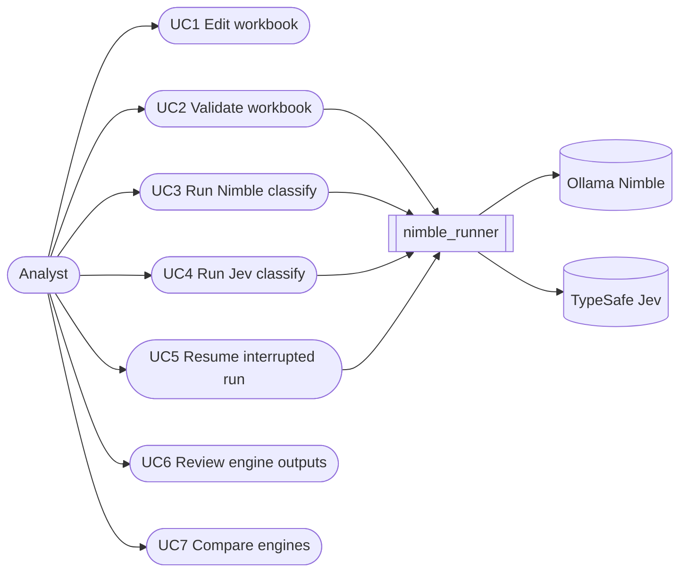
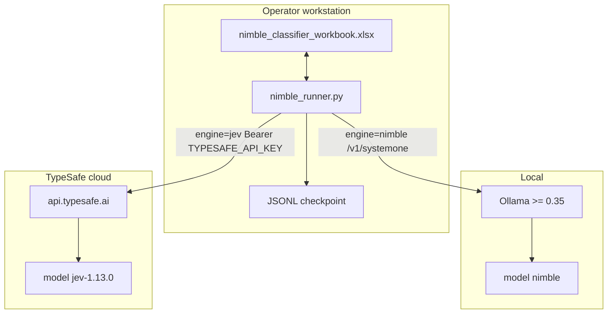
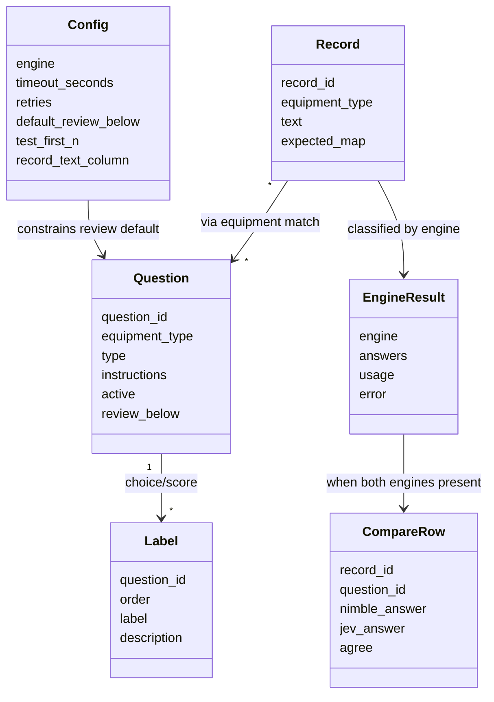
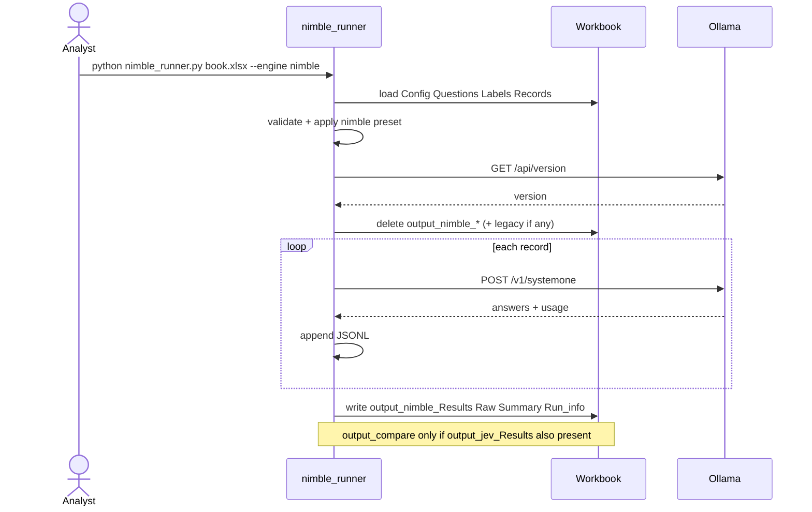
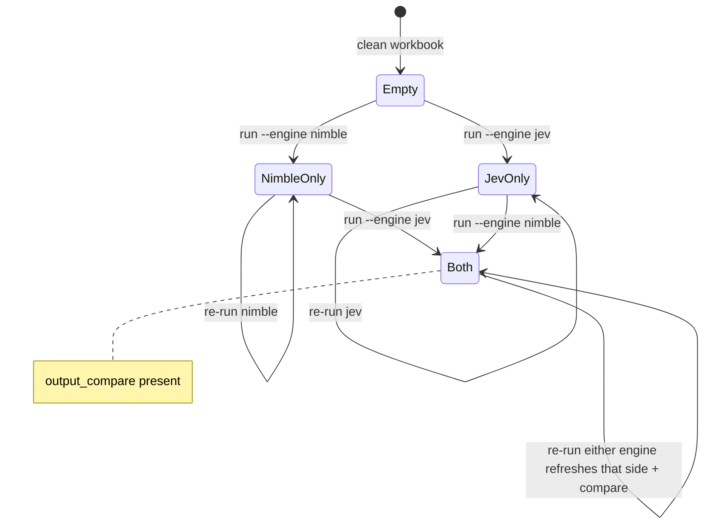

# Functional Specification — nimble_plant v1.0-dev

| Field | Value |
|---|---|
| Product | `nimble_plant` batch classifier |
| Status | As-built on branch `v1.0-dev` |
| Scope | **Both** engines in one workbook: **Nimble** (local Ollama) and **Jev** (TypeSafe hosted) |
| Artifacts | [`nimble_runner.py`](../nimble_runner.py), [`nimble_classifier_workbook.xlsx`](../nimble_classifier_workbook.xlsx) |
| Out of scope | tag `v0.1.0` / `main` (older Nimble-only workflow) |
| UML | Mermaid: use case, component, domain, activity, sequence (×2), state |

How to run day-to-day: the single project guide [../README.md](../README.md) (Nimble **and** Jev).

---

## 1. Purpose

Classify plant-operations free text into structured answers (choice / yes-no / score) via `/v1/systemone`.

This revision is **dual-engine**: the same questions and records can be classified with **Nimble** and/or **Jev**. Operators edit the workbook in Excel/LibreOffice, run the CLI with `--engine nimble` or `--engine jev`, and get separate result sheets. When both engines have Results, `output_compare` is refreshed. One engine’s run never deletes the other’s outputs.

---

## 2. Actors

| Actor | Role |
|---|---|
| Analyst | Edits workbook (Config, Questions, Labels, Records); runs CLI; reviews outputs |
| Runner (`nimble_runner.py`) | Validates, selects engine, calls API, writes sheets / JSONL |
| Ollama (Nimble) | Local decision model host (`http://localhost:11434`) |
| TypeSafe API (Jev) | Hosted decision model (`https://api.typesafe.ai`) |

---

## 3. Use cases (UML)



### Use-case briefs

| ID | Name | Precondition | Main success | Postcondition |
|---|---|---|---|---|
| UC1 | Edit workbook | Workbook unlocked in Excel/LibreOffice | Sheets updated | Spec ready for run |
| UC2 | Validate | Workbook path valid | Exit 0 if rules pass; else list errors | No API calls |
| UC3 | Run Nimble | Ollama ≥ 0.35, model `nimble` pulled | All selected records classified | `output_nimble_*` written; other engine sheets untouched |
| UC4 | Run Jev | `TYPESAFE_API_KEY` set | Same for Jev | `output_jev_*` written; Nimble sheets untouched |
| UC5 | Resume | Valid JSONL checkpoint for same questions hash | Remaining records processed | Checkpoint appended; sheets rewritten for that engine |
| UC6 | Review outputs | Engine Results exist | Analyst inspects answers / review flags / tokens | — |
| UC7 | Compare | Both `output_*_Results` exist | `output_compare` refreshed on second engine’s write | Agree/diff vs expected visible |

---

## 4. Functional requirements

### 4.1 Engine selection

| ID | Requirement |
|---|---|
| FR-E1 | Supported engines: `nimble`, `jev`. |
| FR-E2 | CLI `--engine` overrides Config `engine`. If neither set, default `nimble`. |
| FR-E3 | Selecting an engine **applies a preset** for `model`, `base_url`, and `endpoint` (workbook values for those keys are overridden at runtime). |
| FR-E4 | Nimble preset: `model=nimble`, `base_url=http://localhost:11434`, `endpoint=/v1/systemone`. |
| FR-E5 | Jev preset: `model=jev-1.13.0`, `base_url=https://api.typesafe.ai`, `endpoint=/v1/systemone`. |
| FR-E6 | Non-local base URL requires `TYPESAFE_API_KEY` (env preferred) or Config `api_key` (discouraged). |

### 4.2 Workbook input

| ID | Requirement |
|---|---|
| FR-W1 | Required sheets: `Config`, `Questions`, `Labels`, `Records`. |
| FR-W2 | Question types: `choice`, `noul`, `score`. |
| FR-W3 | `choice`/`score` need ≥ 2 labels; `noul` must have none. |
| FR-W4 | IDs (`question_id`, labels) match `^[A-Za-z0-9_\-]+$`. |
| FR-W5 | Active questions only (`active` ≠ `N`); blank equipment matches all equipment types. |
| FR-W6 | Optional `expected_<question_id>` columns enable accuracy in Summary / compare. |
| FR-W7 | `--test` limits to Config `test_first_n` records (if > 0). |

### 4.3 Output sheet lifecycle

| ID | Requirement |
|---|---|
| FR-O1 | Per engine write: `output_<engine>_Results`, `_Raw`, `_Summary`, `_Run_info`. |
| FR-O2 | At run start, clear **only** that engine’s `output_<engine>_*` sheets. |
| FR-O3 | Never delete the other engine’s prefixed sheets. |
| FR-O4 | Also remove legacy unprefixed `output_Results|Raw|Summary|Run_info` if present. |
| FR-O5 | When **both** Results sheets exist after a write, refresh `output_compare`. |
| FR-O6 | Disagreeing compare rows are visually highlighted. |
| FR-O7 | Results rows with review reasons use review highlighting. |

### 4.4 Runtime / resilience

| ID | Requirement |
|---|---|
| FR-R1 | Per-record POST to `{base_url}{endpoint}` with retries from Config. |
| FR-R2 | Persist JSONL checkpoint `<workbook_stem>_<engine>_<timestamp>.jsonl` for resume. |
| FR-R3 | `--resume` refuses checkpoint if Questions/Labels hash changed. |
| FR-R4 | Capture `usage` tokens when API returns them; store in Raw + Run_info totals. |
| FR-R5 | Workbook must not be locked by Excel/LibreOffice during write. |

### 4.5 Non-goals (this revision)

- Merging `v1.0-dev` into `main` / releasing `v1.0.0`
- Training or fine-tuning models
- Multi-user concurrent writes to one workbook
- GUI beyond Excel/LibreOffice

---

## 5. Component view (UML)



---

## 6. Domain model (workbook entities)



### Question → API payload mapping

| Type | Payload `questions[id]` |
|---|---|
| `choice` | `{ type, instructions, criteria: { label: description\|null } }` |
| `noul` | `{ type, instructions }` |
| `score` | `{ type, instructions, criteria: [description\|label, ...] }` in order |

Request body: `{ model, state: record.text, questions }`.

---

## 7. Activity — classify run (UML)

```mermaid
flowchart TD
  start([Start CLI]) --> load[Load workbook spec]
  load --> validate{Validate}
  validate -->|errors| fail([Exit 1: print errors])
  validate -->|ok| eng[Resolve engine CLI then Config]
  eng --> preset[Apply engine preset]
  preset -->|--validate-only| doneVal([Exit 0])
  preset --> probe[Probe endpoint]
  probe -->|fail| failProbe([Exit: cannot reach API])
  probe -->|ok| clear[Clear this engine output sheets plus legacy]
  clear --> loop{More records?}
  loop -->|yes| call[POST /v1/systemone]
  call --> ckpt[Append JSONL]
  ckpt --> loop
  loop -->|no| write[Write output_engine sheets]
  write --> both{Both Results exist?}
  both -->|yes| cmp[Refresh output_compare]
  both -->|no| skip[Skip compare]
  cmp --> done([Exit 0])
  skip --> done
```

---

## 8. Sequence — Nimble run (UML)



---

## 9. Sequence — Jev run (UML)

```mermaid
sequenceDiagram
  actor Analyst
  participant Runner as nimble_runner
  participant WB as Workbook
  participant API as TypeSafe API

  Analyst->>Runner: export TYPESAFE_API_KEY; --engine jev
  Runner->>WB: load spec
  Runner->>Runner: validate + apply jev preset
  Runner->>API: GET /v1/models Authorization Bearer
  API-->>Runner: OK
  Runner->>WB: delete output_jev_* only keep nimble sheets
  loop each record
    Runner->>API: POST /v1/systemone
    API-->>Runner: answers + usage
  end
  Runner->>WB: write output_jev_*
  Runner->>WB: refresh output_compare if nimble Results exist
```

---

## 10. State — output sheets (UML)



---

## 11. CLI contract

```text
python nimble_runner.py <workbook.xlsx>
    [--engine {jev,nimble}]
    [--validate-only]
    [--test]
    [--resume JSONL]
    [--out-dir DIR]
```

| Flag | Behavior |
|---|---|
| `--engine` | Overrides Config; applies preset |
| `--validate-only` | Validate and exit; no clear, no API |
| `--test` | First `test_first_n` records |
| `--resume` | Continue from checkpoint |
| `--out-dir` | Checkpoint directory (default: workbook folder) |

Exit codes: `0` success; `1` validation or configuration failure (unreachable endpoint, bad engine, hash mismatch on resume).

---

## 12. Output sheet fields (summary)

| Sheet | Key columns / content |
|---|---|
| `output_<engine>_Results` | Record meta + text; per question `__answer`, `__confidence`, `__value`; `needs_review`, `review_reasons`, `error` |
| `output_<engine>_Raw` | `record_id`, `usage_json`, `raw_answers_json` |
| `output_<engine>_Summary` | Per-question asked/answered/review/mean confidence; accuracy when expected present |
| `output_<engine>_Run_info` | engine, model, base_url, tokens, elapsed, checkpoint path, … |
| `output_compare` | `record_id`, `question_id`, `nimble_answer`, `jev_answer`, `agree`, confidences, `expected`, correctness flags |

---

## 13. Security & configuration

- Prefer environment `TYPESAFE_API_KEY`; leave Config `api_key` blank.
- Never commit API keys or JSONL checkpoints (`.gitignore` includes `*.jsonl`).
- Do not paste secrets into chat or tickets; rotate if exposed.

---

## 14. Acceptance criteria (v1.0-dev)

| # | Criterion | Verification |
|---|---|---|
| A1 | `--validate-only` passes on control workbook | CLI exit 0 |
| A2 | `--engine nimble --test` writes only `output_nimble_*` | Sheet inventory |
| A3 | Subsequent `--engine jev --test` keeps Nimble sheets | Sheet inventory |
| A4 | `output_compare` appears after both Results exist | Sheet + agree column |
| A5 | Re-running Nimble does not delete Jev sheets | Isolation test |
| A6 | Token totals recorded when API returns usage | Run_info / Raw |
| A7 | Docs describe both engines and compare | README + this spec |

---

## 15. Related documents

| Document | Role |
|---|---|
| [../README.md](../README.md) | Operator quick start |
| Workbook **Read Me** sheet | In-file editing rules |
| [../experiments/README.md](../experiments/README.md) | Archived dual-workbook experiment |
| Tag [`v0.1.0`](https://github.com/ranga291257/nimble_plant/tree/v0.1.0) | Prior Nimble-only behavior |

