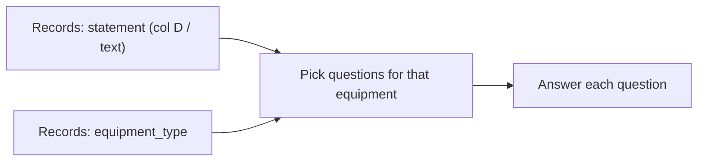

# Functional Specification — nimble_plant

| | |
|---|---|
| Control file | [`nimble_classifier_workbook.xlsx`](../nimble_classifier_workbook.xlsx) |
| Program | [`nimble_runner.py`](../nimble_runner.py) |
| Engines | **Nimble** (local) or **Jev** (TypeSafe) — same question pack, same answer forms |
| How to run | [`../README.md`](../README.md) |

---

## 1. Real use case (start here)

Everything begins with one plant **statement**.

In the spreadsheet that lives on **Records**, column **D**. The sheet header is `text`; in plain language it is the **statement** — the free-text note someone wrote about what is going on with the plant.

That same row also carries an **equipment type** (pump, heat exchanger, distillation column, …) and usually a tag. The statement is classified **under** that equipment type: we already know *what kind of asset* the note is about.

Then the program uses the statement to **figure things out** — not by inventing free prose, but by answering a fixed set of questions that matter for reliability:

- What kind of problem is this? (failure mode / problem class)
- Is containment lost?
- How loaded / urgent / severe is it?
- For some equipment only: cross-contamination (exchanger), off-spec product / stability (column), and so on

So the industry loop is:

**statement → equipment type → applicable questions → structured answers**

Nimble and Jev are just two engines that can run that same loop. The spreadsheet defines *what* to ask; the program builds the query; the engine returns the answers.



---

## 2. What “figuring things out” means

For one statement the runner does not ask “tell me about this pump.” It asks the **Questions** sheet — only the rows that apply to this equipment.

| Kind | On Questions sheet | When it runs |
|---|---|---|
| **Common** | `equipment_type` left blank | Every statement (any equipment) |
| **Unit-op** | `equipment_type` set (e.g. Heat Exchanger) | Only when the record’s equipment matches |

**Labels** hold the allowed answers for categories and scales. The same common question (e.g. failure mode) can use **different label catalogs per equipment** so a pump is not offered “fouling” and an exchanger is not offered “seal.”

That is the classification algorithm: the statement is the input; equipment type selects the question pack; each question returns one structured field.

---

## 3. Three answer forms (how answers come back)

Every question is one of three types. That is what Nimble/Jev know how to score.

| Type | Meaning | Spreadsheet source | Example |
|---|---|---|---|
| **choice** | Pick one category | Labels for that question (optionally per equipment) | failure mode → `seal`, `fouling`, … |
| **noul** | Yes / no | No labels | containment loss → true/false |
| **score** | Place on an ordered scale | Labels in `order` (low → high) | urgency → `routine` / `soon` / `immediate` |

There is no free-form essay output. The Results sheet is one row per statement × question: human title, answer, confidence.

---

## 4. Spreadsheet ↔ program connection

The workbook **is** the spec of the classifier. The program reads sheets; it does not invent the taxonomy.

| Sheet | Role |
|---|---|
| **Records** | One row = one case. Column D `text` = **statement**. Also `equipment_type`, tag, optional `expected_*` for QC. |
| **Questions** | What to figure out: id, title, type (`choice`/`noul`/`score`), instructions, optional equipment scope. |
| **Labels** | Allowed answers / score levels; may be scoped by `equipment_type`. |
| **Config** | Defaults (timeouts, review threshold, …). Engine still chosen at run time. |
| **output_\<engine\>_Results** | What was figured out: statement + question + answer. |
| **output_compare** | Same statements, Nimble vs Jev side by side. |

For each Records row the program:

1. Takes the **statement** (`text`) and **equipment_type**.
2. Selects active Questions that are common or match that equipment.
3. Attaches Labels (filtered by equipment where set).
4. Sends one `/v1/systemone` body: `state` = statement, `questions` = the typed pack.
5. Writes answers back to Results.

```json
{
  "model": "<nimble | jev-…>",
  "state": "<the statement from Records column D>",
  "questions": {
    "<question_id>": {
      "type": "choice | noul | score",
      "instructions": "…",
      "criteria": "…"
    }
  }
}
```

Same body shape for Nimble and Jev. Only base URL, model name, and auth differ.

---

## 5. Why Nimble and Jev both exist

| | Nimble | Jev |
|---|---|---|
| Where | Local Ollama | TypeSafe cloud |
| Auth | none | `TYPESAFE_API_KEY` |
| Contract | `/v1/systemone` | `/v1/systemone` |

Run either or both on the **same** statements and question pack; use `output_compare` when both Results exist. That is how we judge engines without changing the industry method.

---

## 6. Requirements (short)

| ID | Requirement |
|---|---|
| FR-1 | Input to classify is the Records **statement** (`text`, column D). |
| FR-2 | Each statement is under an `equipment_type`; that selects which questions run. |
| FR-3 | Questions are common (blank equipment) or unit-op scoped. |
| FR-4 | Every question is only `choice`, `noul`, or `score`. |
| FR-5 | Labels may differ by equipment under one shared `question_id`. |
| FR-6 | Engines share one request contract; Results are long-format (one row per answer). |
| FR-7 | Secrets stay in the environment — never in the workbook. |

---

## 7. Acceptance (does the use case work?)

| Check | Pass |
|---|---|
| Statement in | Every Results path can be traced to a Records statement. |
| Equipment scopes work | Pump and exchanger both get common fields; exchanger-only / column-only questions do not leak to the wrong class. |
| Three forms | Choice → a Labels value; noul → true/false; score → a Labels level. |
| Dual engine | Same workbook, same statements, Nimble and/or Jev, optional compare. |
